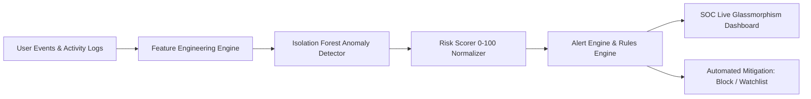

# 🛡️ Sentinel AI — Real-Time Insider Threat & Anomaly Detection System

<div align="center">

[](https://arnab0513.github.io/Sentinel/)
[](https://youtu.be/SlIbQC0tJ44)
[](https://www.python.org/)
[](https://flask.palletsprojects.com/)
[](https://scikit-learn.org/)

**Enterprise-grade internal fraud detection and behavioral anomaly intelligence platform.**

[🚀 Explore Live Dashboard](https://arnab0513.github.io/Sentinel/) • [📺 Watch Demo Video](https://youtu.be/SlIbQC0tJ44) • [📖 Documentation](#-key-features) • [⚡ Quickstart](#-getting-started)

</div>

---

## 📺 Video Demonstration

Experience Sentinel AI in action — watch the live system demonstration, real-time threat detection, and administrative action workflow:

<div align="center">

[](https://youtu.be/SlIbQC0tJ44)

👉 **[Click Here to Watch the Full Demo on YouTube (https://youtu.be/SlIbQC0tJ44)](https://youtu.be/SlIbQC0tJ44)**

</div>

---

## 🌐 Quick Access Links

| Resource | Link | Description |
| :--- | :--- | :--- |
| 🚀 **Live Web Application** | **[arnab0513.github.io/Sentinel](https://arnab0513.github.io/Sentinel/)** | Interactive static dashboard hosted on GitHub Pages |
| 🎬 **Demo Video** | **[YouTube: SlIbQC0tJ44](https://youtu.be/SlIbQC0tJ44)** | Complete walkthrough video demonstrating the features |
| 📦 **GitHub Repository** | **[Arnab0513/Sentinel](https://github.com/Arnab0513/Sentinel)** | Source code and deployment workflows |

---

## 📌 Executive Overview

**Sentinel AI** is an intelligent security operations center (SOC) dashboard and real-time behavioral anomaly detection engine. It proactively detects insider threats, credential misuse, data exfiltration, and privilege escalation before data breaches occur.

Using an unsupervised **Isolation Forest** machine learning algorithm, Sentinel establishes behavioral baselines for internal users across multiple dimensions (time of access, geolocation, data volume, authentication velocity, and privilege level) and flags outliers with granular risk scoring.



---

## ✨ Key Capabilities

### 🧠 Unsupervised Anomaly Detection
- Powered by Scikit-Learn's **Isolation Forest** algorithm.
- Operates without labeled training datasets, uncovering zero-day insider threat patterns.
- Evaluates multidimensional feature matrices (10 behavioral signals).

### 🎯 Granular Risk Indexing (0–100 Scale)
- Translates raw continuous anomaly scores into intuitive risk levels:
  - 🔴 **HIGH RISK (Score 75–100)**: Immediate automated alert and recommended user lockdown.
  - 🟡 **MEDIUM RISK (Score 50–74)**: Suspicious activity; automated watchlist assignment.
  - 🔵 **LOW RISK (Score 25–49)**: Minor deviation from normal baseline; logged for review.
  - 🟢 **NORMAL (Score 0–24)**: Standard operational baseline.

### 🗺️ Live Threat Geolocation Map
- Interactive geospatial map powered by Leaflet.js and OpenStreetMap / CARTO.
- Pinpoints global logins, flags impossible travel anomalies, and identifies VPN / Tor exit nodes.

### 🛡️ Real-Time Incident Response Terminal
- **One-Click User Quarantine**: Terminate active sessions and block suspicious IDs globally.
- **Dynamic Watchlist**: Place suspicious accounts under high-frequency telemetry observation.
- **Audit Logging**: Comprehensive chronological event trail recording all administrative mitigation steps.

### 📊 Real-Time Glassmorphic SOC UI
- Dark-mode, cyberpunk-inspired SOC interface with real-time Chart.js telemetry.
- 24-hour activity heatmaps, department risk matrices, and threat timeline trends.

---

## 🔬 Machine Learning Pipeline

```
Raw Activity Log ──> [Feature Extraction] ──> [StandardScaler] ──> [Isolation Forest] ──> [Risk Normalization]
```

### 1. Extracted Feature Vector (10 Dimensions)
| Feature Name | Description | Threat Indicator |
| :--- | :--- | :--- |
| `login_hour` | Hour of day (0–23) | Temporal baseline deviation |
| `after_hours` | Binary flag for 10 PM – 6 AM access | Late-night unauthorized access |
| `login_count_24h` | Daily authentication frequency | Account hijacking / scripted activity |
| `failed_attempts` | Number of failed authentications | Credential stuffing / brute force |
| `data_volume_mb` | MBs accessed or downloaded | Data exfiltration & bulk dumps |
| `unique_ips` | Distinct IPs associated with user | Account sharing / proxy jumping |
| `new_location` | Unrecognized geolocation flag | Geo-impossible travel anomaly |
| `privilege_level` | Role tier (1: User, 2: Mgr, 3: Admin) | Contextual privilege weight |
| `action_velocity` | Actions triggered per minute | Bot / automated scraping attack |
| `weekend_activity` | Weekend access flag | Off-schedule unauthorized access |

### 2. Anomaly Scoring & Mathematical Mapping
The Isolation Forest calculates raw anomaly scores $s \in [-0.5, 0.1]$. Sentinel normalizes this score into a percentage index $R \in [0, 100]$:

$$R = \text{round}\left(\frac{\text{clamp}(s, -0.5, 0.1) - 0.1}{-0.5 - 0.1} \times 100\right)$$

---

## 📁 Repository Structure

```directory
├── backend/
│   ├── app.py              # Flask application & REST API server
│   ├── alert_engine.py     # Alert evaluation & incident response dispatcher
│   ├── risk_scorer.py      # Normalizes anomaly scores into 0-100 risk levels
│   └── __init__.py
├── ml/
│   ├── model.py            # Feature engineering & Isolation Forest wrapper
│   ├── data_simulator.py   # Synthetic user generator for baseline & threats
│   └── __init__.py
├── frontend/
│   └── templates/
│       └── index.html      # Glassmorphic SOC Dashboard template for Flask
├── .github/
│   └── workflows/
│       └── static.yml      # Automated GitHub Pages CI/CD deployment
├── index.html              # Standalone client dashboard for GitHub Pages
├── requirements.txt        # Pinned Python package dependencies
├── Procfile                # Production WSGI server configuration (Gunicorn)
├── SECURITY.md             # Security policy and reporting guide
└── README.md               # Complete platform documentation
```

---

## ⚡ Getting Started (Local Setup)

### 1. Prerequisites
- **Python 3.10+**
- **Git**

### 2. Clone and Setup Environment
```bash
# Clone repository
git clone https://github.com/Arnab0513/Sentinel.git
cd Sentinel

# Create virtual environment
python3 -m venv .venv
source .venv/bin/activate   # On Windows: .venv\Scripts\activate

# Install dependencies
pip install -r requirements.txt
```

### 3. Run the Sentinel Backend
```bash
python3 backend/app.py
```
*The Flask server starts at `http://127.0.0.1:8080`.*

### 4. Launch the Dashboard
Open your browser and navigate to:
```
http://127.0.0.1:8080
```

---

## 🔌 API Reference

| Method | Endpoint | Description |
| :--- | :--- | :--- |
| `GET` | `/` | Serves the main SOC dashboard interface |
| `POST` | `/predict` | Predicts anomaly score & risk level for an event payload |
| `GET` | `/users/flagged` | Retrieves top anomalous users currently detected |
| `GET` | `/alerts` | Streams active threat alerts |
| `GET` | `/metrics` | Returns overall system risk index and department metrics |
| `GET` | `/stats/timeline` | Generates anomaly score time-series data for telemetry charts |
| `POST` | `/user/block` | Quarantines a user and terminates active sessions |
| `POST` | `/user/watchlist` | Adds a suspicious user to the continuous monitoring list |
| `POST` | `/user/unblock` | Restores a quarantined user to normal status |
| `POST` | `/alert/dismiss` | Dismisses an active alert |
| `GET` | `/model/info` | Returns model metadata, feature names, and precision/recall stats |

---

## 🚀 Production Deployment

Sentinel is production-ready for deployment on **Heroku**, **Render**, **Railway**, or **Google Cloud Run**:

```bash
# Run with Gunicorn WSGI server
gunicorn --bind 0.0.0.0:${PORT:-8080} backend.app:app
```

---

## 📄 License & Attribution

Developed with ❤️ by **[Arnab Jana](https://github.com/Arnab0513)**.  
Released under the MIT License.
